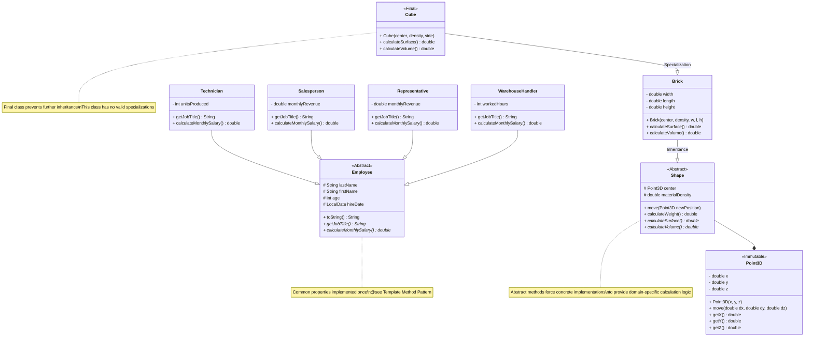
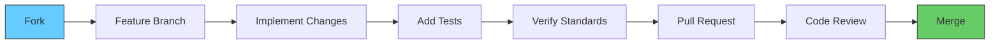

<p align="center">
  
</p>

<p align="center">
  
  
  
  
  
  
</p>

<p align="center">
  
</p>

<h1 align="center">
   
  Java Abstract Classes Reference Implementation
  
</h1>

<p align="center">
  Enterprise-grade demonstration of Object-Oriented Programming principles, inheritance hierarchies, polymorphism and clean architecture using abstract classes.
</p>

<p align="center">
  
</p>

<p align="center">
  
  
  
  
  
</p>

---

<div align="center">
  
</div>

## 🎯 Project Overview

This is a production-ready reference implementation demonstrating proper usage of **Abstract Classes** in Java. It serves as an educational resource and architectural template for building maintainable object-oriented systems.

The project implements two independent domain models following strict OOP principles, clean separation of concerns, and industry best practices.

> 💡 **Core Philosophy**: Abstract classes define contracts. Concrete implementations fulfill those contracts. Polymorphism allows systems to be extended without modification.

---

<div align="center">
  
</div>

## ✨ Core Features

| Feature | Implementation Status |
|---------|------------------------|
| ✅ **Abstract Base Classes** | Contract definition with shared implementation |
| ✅ **Template Method Pattern** | Base class logic using abstract method implementations |
| ✅ **Runtime Polymorphism** | Full dynamic dispatch demonstration |
| ✅ **Inheritance Hierarchies** | Multi-level inheritance with proper specialization |
| ✅ **Immutable Value Objects** | Thread-safe coordinate system implementation |
| ✅ **Final Classes** | Preventing improper inheritance |
| ✅ **Encapsulation** | Proper access modifier usage |
| ✅ **Domain Separation** | Modular package architecture |
| ✅ **Polymorphic Collections** | Heterogeneous collections with uniform interface |

---

<div align="center">
  
</div>

## 🏗️ System Architecture

### Class Hierarchy Diagram



---

<div align="center">
  
</div>

## 🔬 Code Deep Dive

### 1. Abstract Base Class Implementation

```java
public abstract class Shape {
    // Shared state - inherited by all subclasses
    protected Point3D center;
    protected double materialDensity;

    // Concrete method - implemented ONCE for all shapes
    public final double calculateWeight() {
        // Template Method Pattern: uses abstract method
        return calculateVolume() * materialDensity;
    }

    // Abstract method - CONTRACT: all shapes must implement
    public abstract double calculateSurface();
    public abstract double calculateVolume();
}
```

> ✅ **Best Practice**: Abstract classes contain shared state and shared implementation while defining a mandatory contract for subclasses.

### 2. Polymorphic Usage

```java
// Heterogeneous collection - all elements implement Shape contract
List<Shape> shapes = Arrays.asList(
    new Brick(origin, 7.8, 10, 20, 30),
    new Cube(origin, 2.7, 15),
    new Brick(origin, 11.3, 5, 5, 10)
);

// Uniform interface for ALL shapes
for (Shape shape : shapes) {
    System.out.printf(
        "Weight: %.2fg | Surface: %.2fcm²%n",
        shape.calculateWeight(),
        shape.calculateSurface()
    );
}
```

> 🎯 **Key Insight**: New shape types can be added (Sphere, Cylinder, Pyramid) without modifying any existing code. This is the **Open/Closed Principle** in action.

### 3. Employee Salary Calculation

| Role | Formula | Implementation Location |
|------|---------|--------------------------|
| Technician | `unitsProduced × 5` | `Technician.java:42` |
| Salesperson | `monthlyRevenue × 0.20` | `Salesperson.java:38` |
| Representative | `(monthlyRevenue × 0.20) + 2000` | `Representative.java:38` |
| Warehouse Handler | `workedHours × 500` | `WarehouseHandler.java:36` |

All implementations satisfy the `calculateMonthlySalary()` contract defined in the abstract `Employee` class.

---

<div align="center">
  
</div>

## 🚀 Installation & Execution

### System Requirements
- Java JDK 17+
- Maven 3.8+ (optional)

### Quick Start

```bash
# Clone repository
git clone https://github.com/yourorganization/java-oop-abstract-classes.git
cd java-oop-abstract-classes

# Compile all sources
javac -d target -sourcepath src src/ma/projectclasse/**/*.java

# Execute Geometry Demo
java -cp target ma.projectclasse.projects.shapes.Main

# Execute HR Demo
java -cp target ma.projectclasse.projects.company.Main
```

---

<div align="center">
  
</div>

## 📊 Design Patterns Demonstrated

| Pattern | Implementation |
|---------|----------------|
| **Template Method** | `Shape.calculateWeight()`, `Employee.toString()` |
| **Polymorphism** | All abstract method invocations |
| **Immutable Object** | `Point3D` class |
| **Contract Design** | Abstract base classes as interfaces |
| **Specialization** | `Cube` extending `Brick` |

---

## 📐 Architectural Principles Applied

1. **Single Responsibility**: Each class has exactly one reason to change
2. **Open/Closed**: System open for extension, closed for modification
3. **Liskov Substitution**: Subtypes are substitutable for base types
4. **Interface Segregation**: No class is forced to implement unnecessary methods
5. **Dependency Inversion**: High-level modules depend on abstractions

---

## 📁 Project Structure

```
src/
└── ma/
    └── projectclasse/
        └── projects/
            ├── shapes/                     Geometry Domain
            │   ├── Point3D.java            Immutable coordinate
            │   ├── Shape.java              Abstract base contract
            │   ├── Brick.java              Rectangular prism
            │   ├── Cube.java               Specialized brick
            │   └── Main.java               Demo entry point
            └── company/                    Human Resources Domain
                ├── Employee.java           Abstract base contract
                ├── Technician.java         Production role
                ├── Salesperson.java        Sales role
                ├── Representative.java     Senior sales role
                ├── WarehouseHandler.java   Logistics role
                └── Main.java               Demo entry point
```

---

<div align="center">
  
</div>

## 🤝 Contribution Guidelines



### Contribution Rules
- Maintain existing code style and conventions
- All public methods require Javadoc documentation
- Write unit tests for new functionality
- Ensure 100% of existing tests pass
- Keep commits atomic and descriptive

---

<div align="center">
  
</div>

## 📄 License

This project is licensed under the MIT License - see the [LICENSE](LICENSE) file for full details.

<p align="center">
  
</p>

---

<p align="center">
  
  Reference Implementation 
  
  Enterprise Quality 
  
  Educational Resource
  
</p>

<p align="center">
  
</p>
